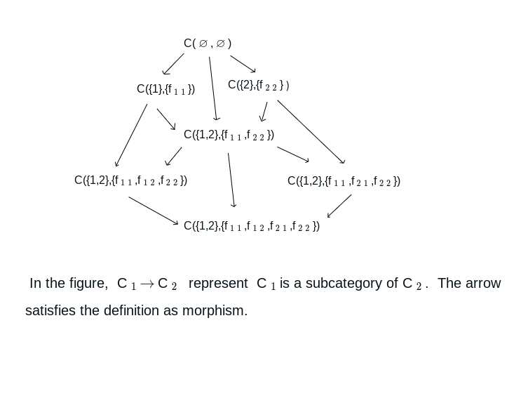

**[Back to Table of Contents](../README.md)**

# Thin Categories (2)  
Subcategories of Thin Categories

## Definition of Subcategories

For a thin category $C(A, f_{ij})(i \in A, j \in A)$, the category $C(B, f_{ij})(i \in B, j \in B)$ induced by a **subclass** $B \subseteq A$ is naturally defined.

Furthermore, let $L$ be a subclass of { $f_{ij}$ } $(i \in B, j \in B)$ satisfying the following two conditions:

1. $L$ is either empty, or $f_{ii} \in L$ for every $i \in B$.
2. If $f_{ij} \in L$ and $f_{jk} \in L$, then $f_{jk} \circ f_{ij} = f_{ik} \in L$.

In this case, $L$ can be regarded as a class of morphisms equipped with the operation $\circ$, allowing us to define a category. We denote this subcategory of $\mathcal{C}_A$ by $\mathcal{C}_A(B, L)$ or $\mathcal{C}(B, L)$. This is again a **thin category**.

## The Category of All Subcategories

Let $ℭ_A$ denote the collection of all subcategories of the thin category $\mathcal{C}_A$.

For $\mathcal{C}_1, \mathcal{C}_2 \in ℭ_A$, we write $\mathcal{C}_1 \subset \mathcal{C}_2$ if $\mathcal{C}_1$ is a subcategory of $\mathcal{C}_2$. This inclusion relation defines a **skeletal thin category** $\mathcal{C}(ℭ_A, \subset)$.

In this category:
- The **initial object** is $\mathcal{C}(\text{empty class}, \text{empty class})$ (the empty category).
- The **terminal object** is $\mathcal{C}(A, \{f_{ij}\}_{i \in A, j \in A})$ (the original category $\mathcal{C}_A$).

When $A$ is a set, $\mathcal{C}(ℭ_A, \subset)$ is a skeletal thin small category (i.e., a partially ordered set).

## Number of Subcategories

In particular, when $A$ is a set of cardinality $n$, the number of objects $\#ℭ_A$ is given by the formula:

$$
\#ℭ_A = \sum_{k=0}^{n} \binom{n}{k} P(k)
$$

where $P(k)$ is the number of preorders on a set with $k$ elements.

**Note**  
It is known that
$$
P(k) = \sum_{i=1}^{k} S(k, i) \cdot PO(i),
$$
where $S(k,i)$ is the Stirling number of the second kind, and $PO(i)$ is the number of partial orders on a set with $i$ elements.

$P(k)$ is registered as **A000798** in the On-Line Encyclopedia of Integer Sequences (OEIS).

Furthermore, when $A$ has cardinality $n$, for each non-empty subset of $A$ there exists exactly one **strongly connected thin category**. Therefore, the total number of strongly connected thin subcategories is $2^n - 1$.

## Concrete Example: Case of Cardinality 2

Let $A = \{1, 2\}$ and $\operatorname{hom}(\mathcal{C}_A) = \{f_{11}, f_{12}, f_{21}, f_{22}\}$. In this case, there are exactly seven subcategories:

1. $B = \emptyset$: **Empty category**
2. $B = \{1\}$, $L = \{f_{11}\}$: Trivial one-object category
3. $B = \{2\}$, $L = \{f_{22}\}$: Trivial one-object category
4. $B = \{1,2\}$, $L = \{f_{11}, f_{22}\}$: Two objects with only identity morphisms
5. $B = \{1,2\}$, $L = \{f_{11}, f_{22}, f_{12}\}$: With an arrow $1 \to 2$
6. $B = \{1,2\}$, $L = \{f_{11}, f_{22}, f_{21}\}$: With an arrow $2 \to 1$
7. $B = \{1,2\}$, $L = \{f_{11}, f_{22}, f_{12}, f_{21}\}$: With arrows in both directions (isomorphic objects)

![Diagram of relations ① to ⑦] 

Indeed, the number of elements in $\mathcal{C}(ℭ_A, \subset)$ is

$$
\sum_{k=0}^{2} \binom{2}{k} P(k) = 1\cdot1 + 2\cdot1 + 1\cdot4 = 7.
$$

The strongly connected thin subcategories are the following three ($2^2 - 1 = 3$):

- $\mathcal{C}(\{1\},\{f_{11}\})$
- $\mathcal{C}(\{2\},\{f_{22}\})$
- $\mathcal{C}(\{1,2\},\{f_{11}, f_{12}, f_{21}, f_{22}\})$
